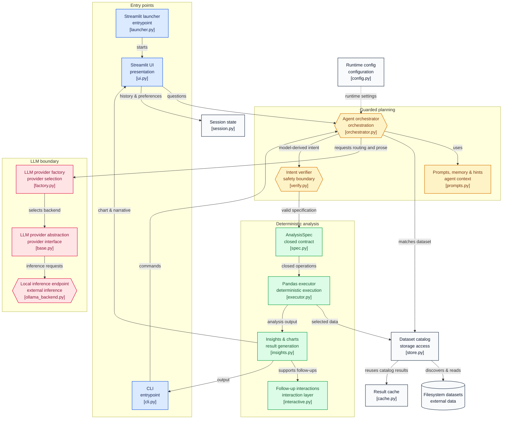

# AI Analyzer V4

AI Analyzer is a local-first data-analysis application. Ask a plain-English
question about tabular data and it selects a dataset, produces a validated
pandas analysis, renders a chart, and writes a grounded summary. It supports a
Streamlit web UI and a terminal CLI.

The model is used only for dataset routing, planning, and prose. It never
executes model-generated code: analysis runs through a closed, validated
`AnalysisSpec` and deterministic pandas operations.

## Handoff status

This repository is ready to hand over as an application project:

- 433 automated tests pass.
- Ruff linting is configured and enforced in GitHub Actions.
- Runtime state, models, data, logs, caches, and local secrets are ignored.
- The checked-in web configuration is safe for a reverse-proxy deployment
  (loopback binding and no browser stack traces).
- A non-root Docker image and production configuration template are included.

The project intentionally does **not** include a model or source datasets.
The deployer must supply both.

## Quick start

Prerequisites: Python 3.10–3.12, a `.parquet` or `.csv` dataset tree, and one
supported local inference backend. Ollama is the recommended backend.

```bash
python -m venv .venv
```

Activate the environment, then install the project and copy the configuration
template:

```bash
# Windows PowerShell
.\.venv\Scripts\Activate.ps1
pip install -e ".[ollama,dev]"
Copy-Item .env.example .env

# Linux / macOS
source .venv/bin/activate
pip install -e ".[ollama,dev]"
cp .env.example .env
```

Put your data in `data/` or set `DATA_DIR` in `.env`. Start Ollama and register
the model named by `OLLAMA_MODEL_NAME`; model templates are in `modelfiles/`.
For example, after placing the matching GGUF in `models/`:

```bash
ollama create ai-analyzer-ministral-8b-iq4 -f modelfiles/ministral-8b-iq4
```

Check the environment and launch the UI:

```bash
python -m app.cli doctor
python -m app.launcher
```

On Windows, `run_ui.bat` is an equivalent shortcut. On Linux/macOS use
`./run_ui.sh`.

## Use it

Open `http://localhost:8501`, choose a dataset root in the sidebar if needed,
and ask a question such as “Top 10 makers in Delhi in 2025”. The UI persists
chats and standing preferences when `PERSIST_CHATS=true`.

The CLI is useful for operations and scripted one-off analysis:

```bash
ai-analyzer doctor
ai-analyzer datasets
ai-analyzer ask "Top 10 makers in Delhi in 2025"
ai-analyzer chat
ai-analyzer chats
ai-analyzer remember region Karnataka
ai-analyzer clear-cache
```

Run `ai-analyzer --help` for the complete command reference.

## Data layout

The catalog accepts Parquet (preferred) and CSV. A common layout is one vehicle
category per folder with one breakdown file per table:

```text
data/
  Two Wheeler/
    MAKER.parquet
    CLASS.parquet
    FUEL.parquet
  Three Wheeler/
    MAKER.parquet
    CLASS.parquet
```

Flat files directly under `data/` also work. Each file is profiled at startup;
the application discovers columns dynamically, so it does not require a fixed
schema. Numeric columns are analysis measures; text and recognised time columns
are dimensions. See [Data format](docs/DATA_FORMAT.md) for the operational
rules.

## Architecture



## Configuration and deployment

Copy `.env.example` for local development. Every documented setting is in
[Configuration](docs/CONFIGURATION.md). For a server, begin with
`.env.production.example` and follow the
[Deployment guide](docs/DEPLOYMENT.md). In particular, do not expose Streamlit
directly to the internet and do not set `AUTH_HEADER` unless a trusted reverse
proxy authenticates users and overwrites that header.

Build the production image with:

```bash
docker build -t ai-analyzer:3.0.0 .
```

The image expects an externally provisioned Ollama endpoint and a read-only
`/data` mount; it does not download models or include private data.

## Development

```bash
python -m pytest
python -m ruff check app tests scripts
```

433 tests, none of which need a model, a GPU, or a network. GitHub Actions runs
them on Python 3.10–3.12 and validates the locked dependency set on 3.11.

**Before changing the analysis pipeline, read
[Design decisions](docs/DESIGN-DECISIONS.md).** Most of the guards in
`app/agent/` exist because the real model produced a specific wrong answer, and
[Testing](docs/TESTING.md) catalogues which failure each one prevents.

## Documentation

| Document | What it covers |
|---|---|
| [Architecture](docs/ARCHITECTURE.md) | Module map, the `AnalysisSpec` boundary, data lifecycle, failure handling |
| [Design decisions](docs/DESIGN-DECISIONS.md) | Why the pipeline is fixed rather than agentic, why insights are computed, model benchmarks, known limitations |
| [Configuration](docs/CONFIGURATION.md) | Every setting, its default, and when to change it |
| [Data format](docs/DATA_FORMAT.md) | What the catalog discovers and how files are profiled |
| [Deployment](docs/DEPLOYMENT.md) | Server install, reverse proxy, authentication, Docker |
| [Operations](docs/OPERATIONS.md) | Running, monitoring, backup, release procedure |
| [Testing](docs/TESTING.md) | Suite layout, the regression table, test conventions |

## Repository map

```text
app/           Application source: UI, CLI, analysis pipeline, data catalog, LLM adapters
tests/         Unit and integration-style tests using a stub LLM
docs/          Architecture, design decisions, configuration, deployment, operations, testing
deploy/        systemd unit and nginx reverse-proxy example
modelfiles/    Ollama templates for supported GGUF files
scripts/       Maintenance utilities, including model benchmarks
models/        Where to put the GGUF (contents gitignored)
```

## Contributing

See [CONTRIBUTING.md](CONTRIBUTING.md). In short: `pytest` and `ruff check` must
pass, and read [Design decisions](docs/DESIGN-DECISIONS.md) before touching the
agent or analysis layers — most of the code there is load-bearing for a reason
that is written down.

## License

MIT. See [LICENSE](LICENSE).
